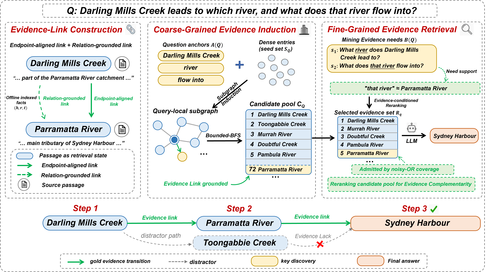

<div align="center">

# EvLink: Source-grounded Evidence Linking for Graph RAG

<p>
  
  <a href="https://github.com/Xiao-AI-Lab/EvLink"></a>
  <a href="https://github.com/Xiao-AI-Lab/EvLink/actions/workflows/tests.yml"></a>
  <a href="https://github.com/Xiao-AI-Lab/EvLink/actions/workflows/package.yml"></a>
</p>
<p>
  <a href="https://www.python.org/downloads/"></a>
  <a href="LICENSE"></a>
  
  <a href="reproduce/README.md"></a>
</p>

<p><strong>Accepted to EMNLP 2026 Main Conference</strong></p>

<p><strong>English</strong> | <a href="README.zh-CN.md">简体中文</a></p>

[Quick Start](#-quick-start) · [Retriever Integration](#-retriever-integration) · [Reproduction](#-paper-reproduction) · [Artifacts](#-artifact-contract) · [Citation](#-citation-and-contact)

</div>

EvLink is a graph-based retriever built on source-grounded evidence links for
Graph RAG. It can run as an end-to-end research pipeline or select a compact,
fixed-budget evidence set from candidates produced by an existing retriever.

<p align="center">
  
</p>
<p align="center"><em>EvLink constructs source-grounded evidence links, induces a query-local evidence region, and selects compact support through evidence-need coverage.</em></p>

> [!NOTE]
> The Python distribution and import package are named `evidencelink`.

## ✨ Highlights

- 🔗 **Source-grounded links** retain passage-level witnesses for graph traversal;
- 🎯 **Coverage-aware selection** composes a fixed reader budget around the
  evidence needs of a question;
- 🔌 **Retriever integration** accepts ordered candidates from dense, sparse, or
  graph retrievers without requiring users to replace their current stack.

The package provides explicit artifact schemas, a deterministic end-to-end
smoke example, and inspectable selection traces.

The included smoke example is intentionally small and deterministic; benchmark
evaluation can be run by replacing the example inputs with the corresponding
prepared artifacts.

## 🧭 Pipeline

The public pipeline follows the paper terminology end to end:

```text
corpus + questions
  -> OpenIE facts
  -> source-grounded evidence-link index
  -> query-local evidence induction
  -> candidate pool C_q
  -> evidence needs B(q)
  -> support cache
  -> coverage-aware evidence selection
  -> final evidence set R_q
  -> optional reader QA
```

## ⚡ Quick Start

```bash
git clone https://github.com/Xiao-AI-Lab/EvLink.git
cd EvLink
python -m venv .venv
. .venv/bin/activate
pip install -e ".[dev]"
python examples/end_to_end.py
```

See [reproduce/README.md](reproduce/README.md) for the reproduction protocol,
[ARTIFACTS.md](ARTIFACTS.md) for artifact formats, and
[docs/RELEASE_SCOPE.md](docs/RELEASE_SCOPE.md) for the v0.1 release boundary.
The post-v0.1 application plan is documented in
[docs/ROADMAP.md](docs/ROADMAP.md).

## 🔌 Retriever Integration

Pass an ordered candidate list to `EvidenceSelector`. The default path is
offline and deterministic; model-backed evidence needs and bindings can be
enabled through `EvidenceSelectorConfig`.

```python
from evidencelink import EvidenceSelector, EvidenceSelectorConfig

selector = EvidenceSelector(
    EvidenceSelectorConfig(reader_budget_k=2, evidence_need_mode="anchor_list")
)
result = selector.select(
    question="Who founded Acme Corporation and where was the founder born?",
    candidates=[
        {
            "doc_id": "d0",
            "title": "Acme Corporation",
            "text": "Acme Corporation was founded by Alice Chen.",
            "score": 0.98,
        },
        {
            "doc_id": "d1",
            "title": "Alice Chen",
            "text": "Alice Chen was born in Singapore.",
            "score": 0.94,
        },
    ],
)

print([item.title for item in result.evidence])
print(result.evidence_needs)
print(result.trace)
```

Run the complete example with:

```bash
python examples/external_retriever.py
```

Passing `workdir="runs/selection"` retains the candidate-pool, evidence-need,
binding-cache, and selection artifacts for inspection. External candidates are
treated as compatibility inputs; only candidates produced by the EvLink
index carry the method's source-grounded link provenance.

## 🧪 Paper Reproduction

Use `evidencelink.api` when wiring EvLink into another benchmark or
paper reproduction workflow. The API names follow the paper artifacts:
candidate pools `C_q`, evidence needs `B(q)`, support cache, and final evidence
sets `R_q`.

```python
from evidencelink import PaperPipelineConfig, run_paper_pipeline

result = run_paper_pipeline(
    corpus_path="corpus.jsonl",
    questions_path="questions.jsonl",
    workdir="runs/evidencelink",
    config=PaperPipelineConfig(dataset="custom", force=True),
)

print(result["selection"])
print(result["selection_summary"])
```

The same boundary is available through the installed runner:

```bash
evidencelink-pipeline \
  --corpus examples/corpus.jsonl \
  --questions examples/questions.jsonl \
  --workdir runs/demo \
  --dataset demo \
  --force
```

## 🗂️ Benchmark Datasets

EvLink includes a lightweight registry and converter for the five paper
benchmarks:

| Dataset | Canonical name | Source format |
| --- | --- | --- |
| HotpotQA | `hotpotqa` | `context` + `supporting_facts` |
| 2WikiMultiHopQA | `2wikimultihopqa` | `context` + `supporting_facts` |
| MuSiQue | `musique` | `paragraphs` + `is_supporting` |
| Natural Questions | `nq_rear` | `contexts` + `is_supporting` |
| PopQA | `popqa` | `paragraphs` + `is_supporting` |

Benchmark source JSON is not distributed in the repository or Python package.
Managed downloads are available for 2WikiMultiHopQA, HotpotQA, and MuSiQue;
the downloader validates downloaded files automatically. NQ-ReAR and PopQA
require manual source placement.

```bash
evidencelink-download-datasets --list
evidencelink-download-datasets \
  --dataset 2wikimultihopqa,hotpotqa,musique
```

The converter then reads `<dataset>.json` and `<dataset>_corpus.json` and
writes standard `corpus.jsonl` and `questions.jsonl` inputs:

```bash
evidencelink-prepare-dataset \
  --dataset musique \
  --output-root runs/datasets/musique \
  --force
```

See [datasets/README.md](datasets/README.md) for upstream terms and
manual-source requirements.

## ▶️ End-to-End Demo

The default demo path is offline: it uses a simple OpenIE extractor, simple
whole-question evidence needs, a simple binding cache, and deterministic
embeddings.

```bash
python scripts/run_pipeline.py \
  --corpus examples/corpus.jsonl \
  --questions examples/questions.jsonl \
  --workdir runs/demo \
  --dataset demo
```

The versioned equivalent is:

```bash
python scripts/run_reproduce_config.py reproduce/configs/offline-smoke.json
```

For model-backed stages, switch individual stages to `llm` and provide an
OpenAI-compatible endpoint:

```bash
python scripts/run_pipeline.py \
  --corpus corpus.jsonl \
  --questions questions.jsonl \
  --workdir runs/evidencelink \
  --openie-mode llm \
  --evidence-need-mode llm \
  --binding-mode llm \
  --llm-base-url "$EVLINK_LLM_BASE_URL" \
  --api-key "$EVLINK_API_KEY"
```

## 🛠️ Stage CLIs

```bash
python scripts/build_openie.py --corpus corpus.jsonl --output openie_facts.jsonl

python scripts/build_index.py \
  --corpus corpus.jsonl \
  --openie openie_facts.jsonl \
  --output evidence_link_index.json

python scripts/build_candidate_pool.py \
  --questions questions.jsonl \
  --corpus corpus.jsonl \
  --index evidence_link_index.json \
  --output candidate_pool.jsonl

python scripts/build_evidence_needs.py \
  --questions questions.jsonl \
  --output evidence_needs.jsonl \
  --mode whole_question

python scripts/build_binding_cache.py \
  --candidate-pool candidate_pool.jsonl \
  --evidence-needs evidence_needs.jsonl \
  --output binding_cache.json \
  --binding-model simple-binding

python scripts/run_evidence_selection.py \
  --dataset custom \
  --pool-json candidate_pool.jsonl \
  --requirement-report evidence_needs.jsonl \
  --binding-cache-path binding_cache.json \
  --output-json evidence_selection.json \
  --embedding-name deterministic-hash \
  --llm-binding-model simple-binding
```

## 📐 Artifact Contract

The main artifact formats are summarized in [ARTIFACTS.md](ARTIFACTS.md).

Facts are grounding material for evidence links; passages remain retrieval
states. The candidate pool `C_q` is not the final evidence set. The final
evidence set `R_q` is produced by coverage-aware evidence selection.

## ✅ Maintained Examples

The following examples are part of the tested v0.1 contract:

| Example | Purpose |
| --- | --- |
| `examples/end_to_end.py` | Complete deterministic pipeline. |
| `examples/external_retriever.py` | Generic ordered candidate integration. |

## 🗃️ Repository Layout

```text
evidencelink/   installable SDK
examples/       maintained offline examples
scripts/        stage and release-validation commands
reproduce/      versioned configs and metric definitions
datasets/       toy fixtures and source preparation docs
tests/          public contract and integration tests
```

## 🩺 Troubleshooting

- The default embedding backend is `deterministic-hash` with the `offline`
  endpoint. Set both `embedding_name` and `embedding_base_url` when switching
  to a model-backed embedding service.
- Model-backed OpenIE, evidence-need, and binding stages require an
  OpenAI-compatible endpoint and API key. The offline examples do not.
- Do not change embedding models inside an existing model-backed index. Rebuild
  the index so document and query vectors share the same embedding space.

## 📚 Citation and Contact

EvLink is accepted to the EMNLP 2026 Main Conference.

**Authors:** Linyao Zheng, Xuhang Shi, Zhifang Mao, Sai Zhou, Shuaixian An, and
Xiuquan Hou.

Citation metadata is provided in [CITATION.cff](CITATION.cff). The camera-ready
paper link and final proceedings BibTeX will be added when the public
bibliographic record is available.

Use [GitHub Issues](https://github.com/Xiao-AI-Lab/EvLink/issues) for bug
reports, integration questions, and reproducibility problems.
